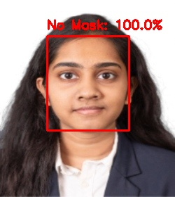
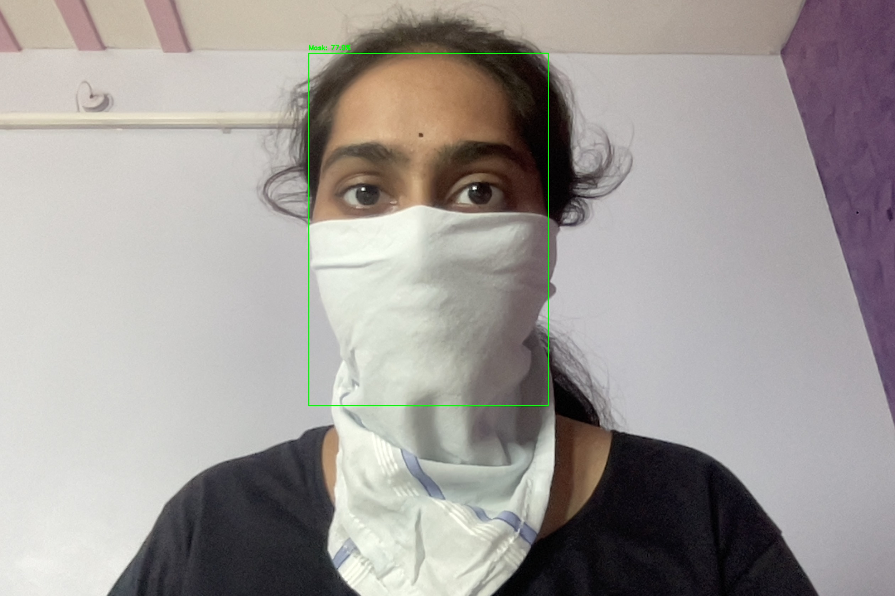

# face-mask-detector-new
Real-time face mask detection using MobileNetV2 and OpenCV
# Face Mask Detector
A deep learning model that detects whether a person is wearing a face mask using MobileNetV2 transfer learning and OpenCV.

## Demo
| Without Mask | With Mask |
|---|---|
|  |  |

## Tech Stack
- Python, TensorFlow, Keras
- MobileNetV2 (transfer learning)
- OpenCV (face detection)
- Google Colab T4 GPU

## Model Performance
- Training Accuracy: ~98%
- Validation Accuracy: ~97%
- Dataset: 7,500+ images
- Training Time: ~10 mins on T4 GPU

## How to Run
1. Open Google Colab and enable T4 GPU
2. Clone dataset: `!git clone https://github.com/prajnasb/observations`
3. Run `train_mask_detector.py` to train the model
4. Run `detect_mask_image.py` and upload a photo to test

## Author
**Sanjana** — B.Tech CS (AI & ML), GITAM University

